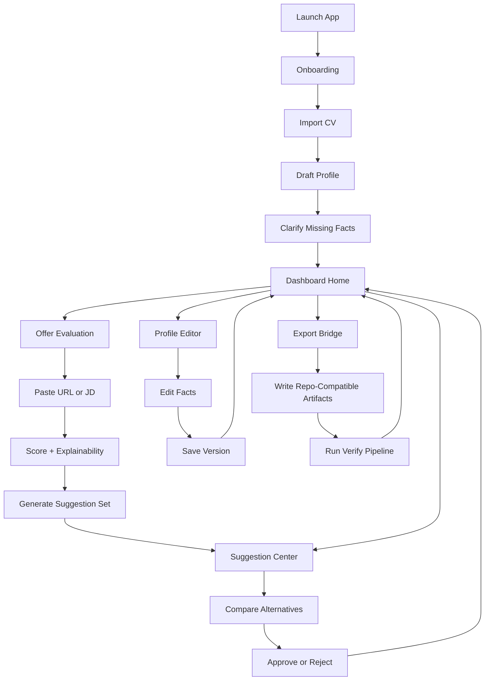

# Wireflow Map - MVP Desktop/Web

Version: 1.0  
Date: 2026-04-09

## Flow Overview

## Navigation States

1. `Onboarding`
2. `Dashboard`
3. `OfferReview`
4. `SuggestionCenter`
5. `ProfileEditor`
6. `AssetViewer`
7. `ExportAndValidation`

## State Transition Rules

1. Onboarding is mandatory until minimum profile completeness is reached.
2. Suggestions cannot mutate canonical facts directly; only approved actions can write.
3. Export action is blocked if model validation fails.
4. Offer review results must be persisted before user can create actions from them.
5. Every approve/reject action emits a pipeline event.

